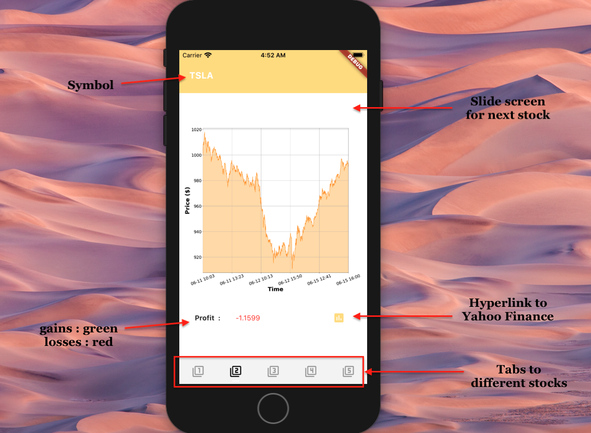
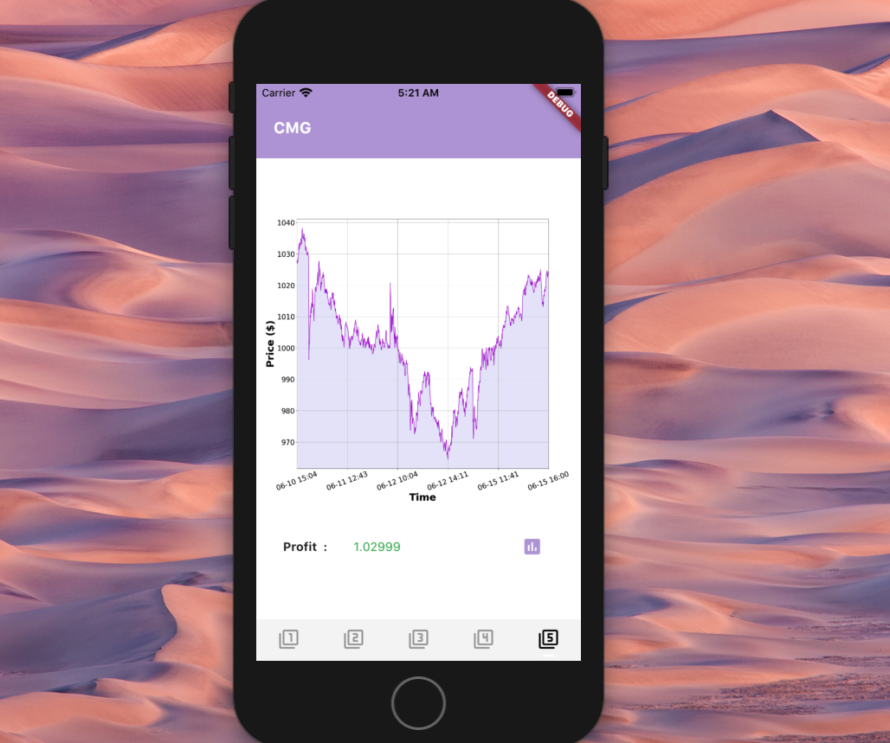

# Stock Bot
-----
### Description
Welcome to the Stock Bot, which presents the following features : 

1) Back End (Python)

    * Web scraping on Yahoo Finance to retrieve most active or most gaining stocks 
    * Sort stocks based on chosen criteria and retrieve top 5 stocks
    * Call API of selected stocks to retreive data in JSON format (time, open/close price, high/low, volume)
    * Cleanse the JSON data to a more readable form and visualize the time series data 

  
2) Front End (Dart/Flutter)

    * Build iOS/Android compatible app with 5 tabs for each of the 5 stocks
    * Each tab displays the following :
  	   * Symbol of stock (e.g. AAPL)
  	   * Displays the time series plot generated by Python
  	   * Estimated profit/loss since start of app runtime 
  	   * Button that links to Yahoo Finance info on the specified stock 
      
-----
### Compile/Run

   1) Download folder and move directory to downloaded path 
   2) Check the following on main.py 
      * Switch between finance.yahoo.com/gainers and finance.yahoo.com/most-active based on need
      * Get your keycode at alphavantage.co and input keycode to retrieve stock API
      * Feel free to switch the path for where the image and JSON file will be created 
   3) Check the following on dart_folder
      * Check that pubspec.yaml is accessing assets from the correct path 
      * Check that main.dart is accessing JSON and image files from the correct path 
   4) On terminal, change directory to py_folder and run 'python main.py'
   5) Wait for images, JSON file to be generated
   6) Turn on iOS or Android simulator
   7) On terminal, change directory to dart_folder and run 'flutter run'

-----
### Images

